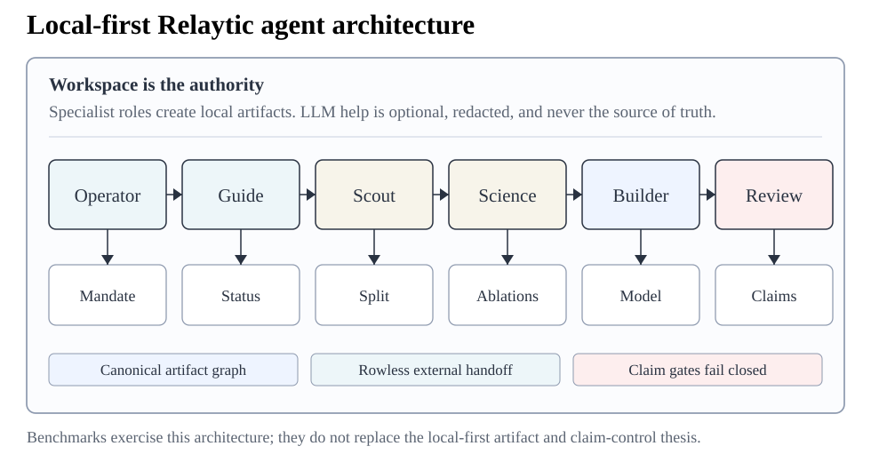
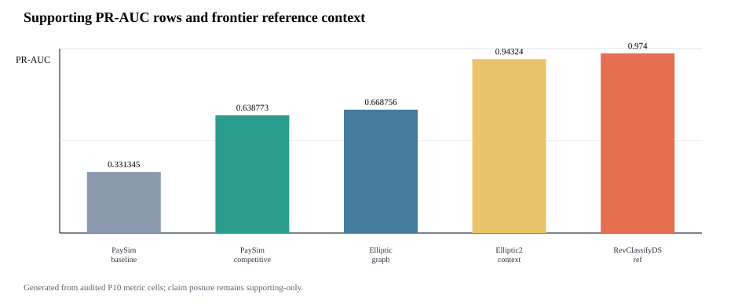
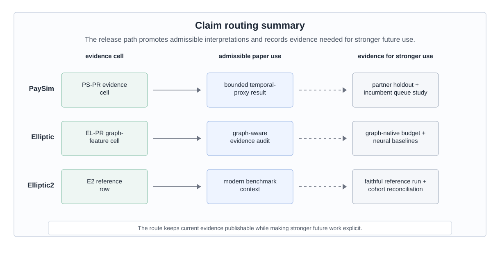
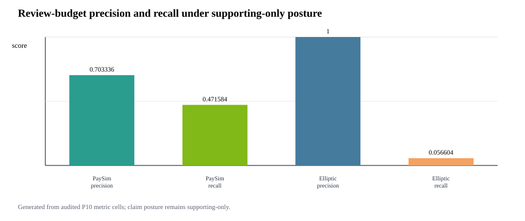

# Relaytic-AML: A Local-First Agentic Evaluation Lab for Financial-Crime Machine Learning

## Abstract

Anti-money laundering (AML) machine-learning experiments are hard to audit when private data, temporal validity, graph provenance, leakage controls, review capacity, and public claims are managed in separate tools. Relaytic-AML is a local-first evaluation lab in which role-scoped agents produce auditable evidence cells and deterministic gates route those cells into admissible paper uses. The current evidence pack reports PaySim synthetic temporal-fraud PR-AUC 0.6388, Elliptic temporal graph-feature PR-AUC 0.6688, and Elliptic2 context PR-AUC 0.9432 +/- 0.0009, with a recorded RevClassifyDS reference of 0.9740. The paper contributes an evaluation and governance substrate for financial-crime ML, with detector claims kept within the evidence boundary.

## 1. Introduction

AML modeling is a rare-event, high-stakes evaluation problem. The input may be a stream of mobile-money transfers, card events, account activity, wire messages, customer profiles, or blockchain transactions. Suspicion rarely appears in one row. It often appears as a temporal or network pattern: fast movement of funds after receipt, repeated transfers through related accounts, structured amounts, new counterparties receiving many payments, activity that does not match a customer's profile, or cryptocurrency behavior that involves risky services and geography. Regulatory and typology material from FATF, FinCEN, and FFIEC describes this kind of pattern-based reasoning in operational language [@fatf2020virtualassets; @fincenAdvisories; @ffiecRedFlags].

A useful score is not enough. A reader needs to know which data stayed local, which columns were available at decision time, how time or graph boundaries were split, whether model selection touched the test surface, what review budget was assumed, and what interpretation the evidence can support. These questions become sharper when large language models (LLMs) or coding agents assist the research workflow, because fluent explanations can drift away from the artifact record unless the system is designed to fail closed.

Relaytic began as a general local-first inference-engineering lab. Relaytic-AML is the financial-crime edition used here to test whether that architecture can support governed AML experimentation. It is a set of cooperating agents and deterministic harnesses around a local artifact store. The guide helps a user or another agent understand where the run is. The scout checks source posture, schema, leakage risk, and split feasibility. The strategist turns the objective into a task contract. The scientist challenges baselines, ablations, and budget choices. The builder executes bounded runs. Reviewers reconstruct traces. Release governors lint claims, figures, tables, source packages, and public wording against the evidence record.

The paper is therefore a systems and methodology paper. The benchmark rows matter because they exercise the architecture under temporal, graph, operating-point, and claim-governance pressure. The central question is whether a local evaluation lab can keep evidence, agent assistance, privacy boundaries, and publishable claims aligned without turning proxy evidence into detector-superiority claims.

The work is organized around four research questions:

- **RQ1:** Can Relaytic-AML produce reproducible evidence cells for AML-style temporal and graph tasks?
- **RQ2:** Can it prevent leakage-prone or unsupported claims from being promoted?
- **RQ3:** Can the local artifact record support rowless handoff to external agents while preserving provenance?
- **RQ4:** Do the benchmark rows demonstrate useful, bounded detector evidence under explicit split and budget contracts?

This paper makes four contributions. First, it presents a workspace-backed, role-scoped agent runtime for AML evaluation. Second, it defines an evidence-cell schema tying each metric to dataset, split, command, artifact, budget, leakage posture, and operating point. Third, it contributes a release and interpretation-routing harness that turns local artifacts into tables, figures, source packages, and manuscript claims while recording the evidence needed for stronger future uses. Fourth, it gives public demonstrations on PaySim, Elliptic, and Elliptic2 reference rows under explicit evidence roles.

## 2. Related Work

The AML benchmark landscape is moving toward larger, more realistic, and more graph-native settings. PaySim remains useful as a synthetic mobile-money fraud simulator for temporal proxy experiments [@lopezrojas2016paysim]. Elliptic introduced a public Bitcoin transaction graph with anonymized node features and temporal labels [@weber2019elliptic]. Elliptic2 and RevTrack/RevClassify shifted attention to suspicious subgraphs and richer blockchain context [@bellei2024elliptic2; @song2024revtrack]. Recent work such as TransXion, LineMVGNN, quasi-temporal graph extraction, BlazingAML, and continual graph-learning studies shows that the research frontier increasingly treats AML as dynamic graph and systems work rather than static tabular classification [@chen2026transxion; @poon2026linemvgnn; @tariq2026extraqt; @ye2026blazingaml; @deprez2025continualaml].

Detector papers such as TransXion, BlazingAML, LineMVGNN, and RevClassifyDS push the model frontier. Relaytic-AML sits one layer around that work: it asks how experiments should be governed when data is local or licensed, the task may be temporal or graph-based, analyst review capacity matters, and an agent-assisted workflow must still produce evidence that a skeptical reviewer can audit. That places the system near dataset documentation, model reporting, reproducibility practice, experiment tracking, and governance work [@gebru2021datasheets; @mitchell2019modelcards; @pineau2021reproducibility].

The system also differs from adjacent evaluation artifacts. Model cards explain a trained model, but they do not usually bind every number to a command, split, artifact field, and admissible-use record. Datasheets describe data, but they do not run the model-search and release gates. Reproducibility checklists improve reporting, but they are often static forms rather than executable evidence. MLOps experiment trackers preserve runs, but they are not designed to govern public scientific claims about local, licensed, or privacy-sensitive AML data. Agent benchmarks evaluate agents, while Relaytic-AML uses agents inside an evaluation lab and then tests whether the lab keeps the agents attached to artifacts. This is the systems contribution: evidence, agents, local privacy, and publishable wording are coupled in one deterministic release path.

**Adjacent systems comparison.**

| Family | Primary object | Relaytic-AML position | Boundary |
|---|---|---|---|
| Model cards and model reporting [@mitchell2019modelcards] | trained model and intended-use report | adds command-level metric provenance, release gating, and stronger-claim blocking around AML experiments | does not replace model reporting |
| Datasheets and dataset documentation [@gebru2021datasheets] | dataset creation, composition, collection, and recommended use | connects dataset posture to split contracts, leakage controls, benchmark rows, and admissible claims | does not replace source-dataset governance |
| ML reproducibility checklists [@pineau2021reproducibility] | reporting checklist and reproducibility discipline | turns checklist-like obligations into executable paper-generation and release gates | does not claim full independent reproduction for licensed data |
| MLOps experiment tracking | runs, metrics, parameters, artifacts, lineage, and model versions | focuses on local AML evidence, privacy posture, rowless handoff, and public scientific claim admissibility | is not a hosted tracker or production model registry |
| Agent benchmarks and research-agent evaluations [@chen2025mlrbench; @starace2025paperbench] | agent performance on research, coding, or skill-use tasks | uses agents inside a governed local evaluation lab and then tests whether their outputs stay artifact-attached | does not benchmark a general-purpose agent |
| AML detector and benchmark papers [@weber2019elliptic; @bellei2024elliptic2] | detector architecture, benchmark result, graph construction, or financial-crime dataset | provides the local evidence and claim-governance substrate that such detector studies can run through | is not a new graph-neural detector and does not claim detector SOTA |

The comparison is intentionally narrow. Relaytic-AML does not replace dataset documentation, model cards, experiment trackers, or detector papers. It occupies the layer that ties those concerns together for local AML research: a model result is only reader-facing after its source posture, split, leakage policy, budget, artifact field, handoff posture, and claim boundary are visible.

Recent agent-evaluation work shows that language-model systems can produce persuasive research artifacts while still failing on reproduction, validation, or expert-level judgment [@chen2025mlrbench; @starace2025paperbench; @wijk2025rebench]. Skill- and tool-using agents make that opportunity larger and the governance problem sharper [@yang2026skillopt]. Relaytic-AML responds by making model scores, public claims, handoff packets, and paper assets downstream of local artifacts rather than downstream of a conversation transcript.

## 3. System Overview

Relaytic-AML is built around one authority rule: the workspace owns the truth. Raw data, licensed benchmark files, run summaries, traces, metric cells, model outputs, tables, figures, and release reports live on disk. Agents may explain, propose, and repair, but their proposals only become evidence when they are materialized as artifacts another human or agent can inspect.



Figure 1 summarizes the local evidence loop. Dataset registries and split contracts enter the role-scoped agent runtime. Candidate runs write benchmark manifests, search traces, feature reports, and metric cells. Claim gates read those cells together with release audits and emit only the interpretations that the evidence supports. The same contract feeds the command-line interface, project skills, OpenClaw-style handoff, Claude/Codex skill files, and Model Context Protocol (MCP) adapters.

The external-agent path is rowless by default. Relaytic can export current state, next-action options, artifact shortlists, and safe commands for another model without sending raw transaction rows, secrets, or private local paths. A local LLM can optionally help phrase guidance, but the deterministic guide and evidence artifacts remain the source of truth. That separation matters for private AML work: outside intelligence may help navigate the run, but data residency and claim provenance stay local unless an operator deliberately changes policy.

## 4. Evidence Cell and Claim-Gate Design

An evidence cell is the unit that makes a paper number auditable. It is not just a metric value. It records the dataset, split, command, artifact field, model or feature budget, leakage posture, and operating point. Interpretation is deliberately stored in a separate gate output: the cell says what happened, and the gate says how that fact may be used.



Table 1 uses compact publication aliases for readability; the full machine metric-cell identifiers are preserved in the metric-cell audit artifact and generated table comments.

**Table 1. Representative evidence cells.**

| ID | Dataset | Metric | Value | Split | Artifact | Evidence role |
|---|---|---|---|---|---|---|
| PS-PR | PaySim | test PR-AUC | 0.6388 | temporal test | PaySim run; manifest | bounded demonstration |
| PS-P@B | PaySim | precision at review budget | 0.7033 | temporal test | PaySim run; manifest | bounded demonstration |
| EL-PR | Elliptic | test PR-AUC | 0.6688 | graph-time test | graph run; feature table | graph-feature evidence |
| EL-P@B | Elliptic | precision at review budget | 1.0000 | graph-time test | graph run; feature table | graph-feature evidence |
| E2-PRm | Elliptic2 | official test PR-AUC mean | 0.9432 | official test | E2 run; scorecard | external reference/context |
| E2-ref | Elliptic2 | published reference PR-AUC | 0.9740 | reported ref. | E2 run; scorecard | external reference/context |

A representative record is compact enough to audit directly. The public table uses the alias `PS-PR`, while the underlying artifact keeps the longer machine identifier. The example separates the factual evidence cell from the gate output that names admissible use and evidence needed for a stronger interpretation.

```json
{
  "evidence_cell": {
    "cell_id": "PS-PR", "dataset_id": "paysim_temporal_transaction_fraud",
    "split": "temporal test", "metric": "test_pr_auc", "value": 0.6388,
    "artifact_ref": "paper_metric_cell_audit.json:test_pr_auc",
    "budget": "competitive", "leakage_posture": "balance/raw IDs excluded",
    "operating_point": "ranking metric"
  },
  "claim_gate_output": {
    "evidence_cell_ids": ["PS-PR"], "admissible_use": "bounded PaySim proxy",
    "stronger_claim_status": "requires external holdout",
    "missing_evidence": ["partner holdout", "incumbent queue study"]
  }
}
```

```algorithm
Algorithm: Evidence-cell creation
Input: dataset registry D, split contract S, candidate budget B, run artifacts A
Output: evidence cell c with factual provenance
1. Freeze source posture, license posture, task target, and split contract.
2. Derive only features allowed by S and record excluded leakage fields.
3. Run baseline candidates under the declared baseline budget.
4. Run stronger candidates only within B and select on validation evidence.
5. Evaluate the selected row once on the fixed test surface.
6. Write c = dataset, split, command, artifact field, metric, value, budget, leakage posture, and operating point.
7. Hand c to the claim gate before it appears in tables, figures, or release text.
```

The claim gate is the second half of the design. It is deliberately conservative. If the evidence cell is incomplete, if a split is leakage-prone, if a metric is only a proxy, or if a stronger interpretation needs a different dataset or study, the gate preserves the evidence and routes the stronger use to an evidence-needs record. This is a mechanism, not a disclaimer: it changes what the paper generator and public release surfaces are allowed to say.

```algorithm
Algorithm: Claim-gate validation
Input: public claim q, evidence cells C, gates G, limitations L
Output: admissible wording and evidence-needs record
1. Resolve every evidence cell named by q and require dataset, split, command, artifact, budget, and leakage fields.
2. Compare the strength of q with source posture, split validity, metric scope, and benchmark role.
3. If q is exactly supported, emit the bounded wording and the evidence-cell identifiers.
4. If q is stronger than C and G permit, record the stronger-claim status and gate reason.
5. Attach the missing evidence needed to make q testable in future work.
6. Route current evidence to its admissible paper use and keep stronger uses out of headline wording.
```



Figure 3 gives concrete routing behavior. A PaySim row becomes a bounded temporal-proxy demonstration, an Elliptic row becomes graph-feature evidence with temporal provenance, and an Elliptic2 row becomes external benchmark context. The same records also specify what evidence would be needed before stronger future uses could be made.

## 5. Experimental Protocol

The experiments test Relaytic-AML as an evaluation lab. The datasets are separated by evidence role. PaySim is the main empirical demonstration because it is fully local and supports a controlled temporal proxy workflow. Elliptic tests temporal graph provenance and feature-view discipline. Elliptic2 tests whether the system can keep a modern external reference row visible without overstating its role.

**Table 2a. Dataset scale and split contracts.**

| Dataset | Task | Scale and positives | Train / validation / test | Split rule | Source hash |
|---|---|---|---|---|---|
| PaySim synthetic mobile-money transaction fraud | Synthetic temporal transaction fraud | 6,362,620 rows/nodes; 8213 positives | train: 6,010,937, pos 0.08%; validation: 228,103, pos 0.68%; test: 123,580, pos 1.34% | time step | sha256 prefix 16910f90577b |
| Elliptic Bitcoin transaction graph | Temporal Bitcoin graph node classification | 203,769 rows/nodes; 4545 positives | train: 26,381, pos 10.88%; validation: 8,999, pos 11.53%; test: 11,184, pos 5.69% | graph time | sha256 prefix 93e2e7b2405c plus 2 files |
| Elliptic2 large Bitcoin subgraph AML dataset | Suspicious-versus-licit subgraph context | 122,000 labeled subgraphs; context row | val 11,059, test 11,105; test positives 272 | fixed partition | not bundled |

**Table 2b. Feature and metric policy.**

| Track | Allowed feature policy | Forbidden or gated inputs | Primary metrics | Evidence role |
|---|---|---|---|---|
| PaySim | 26 decision-time features; balance columns excluded | balance columns, raw account IDs, simulator flags, random row shuffles | PR-AUC, P@k, R@budget | bounded demonstration |
| Elliptic | structural same snapshot only; source provided flattened features; source features plus structural snapshot | future-to-train edges and random node splits across time | PR-AUC, P@k, fixed-FPR recall | graph-feature evidence |
| Elliptic2 | pooled moments counts; raw subgraphs local-gated | claim use gated by reference parity and local data availability | PR-AUC, P@k, fixed-FPR recall | external reference/context |

Tables 2a and 2b record the context a reader needs before interpreting any metric. The positive rates show why precision-recall area under the curve (PR-AUC) is the primary score. These are rare-event tasks where receiver-operating-characteristic area under the curve can look strong while the review queue remains poor. The split rules are equally important: PaySim is split by chronological simulator step, Elliptic by time-step graph windows, and Elliptic2 by the official/context partitions recorded in the local evidence pack.

**Table 3. Model families and search budgets.**

| Track | Families | Features | Search budget | Evidence role |
|---|---|---|---|---|
| PaySim | tree and boosting candidates; Extra Trees selected | amount, type, time, shifted destination history | 14 probes; 5 finalists; seeds 42 | validation PR-AUC; one fixed test |
| Elliptic | tree/boosting baselines; LightGBM selected | source node features plus same-step graph statistics | 16 trials; seeds 42 | graph-feature evidence row |
| Elliptic2 | LightGBM context row | 348 pooled subgraph moments/counts | 3 repeated seeds: 11, 42, 73 | external reference row |

Table 3 records the modeling effort without presenting the paper as a hyperparameter leaderboard. PaySim uses a two-stage competitive budget: probes over a seeded train-only sample, five full-training finalists, validation-only calibration, and one fixed test evaluation for the selected finalist. Elliptic uses a graph-feature budget over source-provided anonymized features, same-snapshot structural features, and their combination. Elliptic2 uses repeated pooled-moment LightGBM context rows with seeds 11, 42, and 73 as an external-reference stress test for the release machinery.

The feature policy is strictest for PaySim because simulator balance columns can leak post-event state. Relaytic excludes those balance fields, raw origin and destination identifiers as model features, and simulator flags. It allows row-local amount, type, and time features, train-only thresholds, and destination history shifted before each step. The isolated contribution of destination-history features has not been measured as a separate test row, so it is not reported as a main result.

## 6. Results

**Table 4. PaySim modeling path.**

| Stage | Model/contract | Selection evidence | Final test evidence | Role |
|---|---|---|---|---|
| P4 reference | SGD logistic baseline | source-safe starting point | 0.2159 | reference row |
| P6 baseline | Extra Trees baseline | leakage-safe feature set | 0.3313 | baseline row |
| Probe screen | best small-sample probe: XGBoost | 26 allowed features; probe validation PR-AUC 0.5944 | no test evaluation | candidate screening |
| Full finalist selection | Extra Trees finalist | full-training validation PR-AUC 0.5687; selected before test | test still hidden | model selection |
| Final fixed test | Extra Trees with Platt calibration | validation-only calibration and threshold | 0.6388 | bounded demonstration |

PaySim is the most complete local modeling path in the current evidence pack. It should be read as an audited sequence rather than as a leaderboard claim. The earliest reference row was PR-AUC 0.2159. The later leakage-safe baseline improved to 0.3313. The small-sample probe screen then identified a strong XGBoost probe, but fixed-test eligibility was decided later among full-training finalists; Extra Trees had the best full-training validation PR-AUC and was the only competitive finalist evaluated on the fixed test. It reached fixed-test PR-AUC 0.6388 and ROC-AUC 0.9683. The improvement is meaningful inside the synthetic temporal-fraud contract because balance fields were excluded, prior-step destination history was added without raw account encoding, candidates were selected by validation evidence, and calibration and thresholding used validation-only partitions. The admissible interpretation is precise: Relaytic-AML produced a stronger, leakage-audited PaySim temporal-proxy row under a declared budget. It is supporting temporal-fraud evidence rather than real-bank AML performance.

The review-budget metrics sharpen the interpretation. At the selected PaySim review budget, precision is 0.7033 and recall is 0.4716. The top of the queue is much richer than prevalence, but a large share of fraud remains outside the reviewed set. That is a useful operating result for an evaluation lab because it connects ranking quality to analyst capacity instead of treating PR-AUC as the whole story.

Elliptic is a different kind of evidence. The validation-selected source-plus-structural LightGBM row reports test PR-AUC 0.6688, with review-budget precision 1.0000 and recall 0.0566. The result supports temporal graph-feature provenance and operating-point reporting. It also reveals a limitation: the current graph-structure-only floor is weak, and the final row is heavily influenced by source-provided anonymized features. Relaytic's contribution here is the graph-aware evidence path: feature provenance, temporal splits, operating-point metrics, and interpretation routing are made auditable together.

Elliptic2 is intentionally framed as an external reference row. The repeated official-partition context row reports PR-AUC 0.9432 +/- 0.0009, and the content-hash robustness partition reports mean PR-AUC 0.9297. Those are strong absolute values, and the recorded RevClassifyDS reference of 0.9740 gives the reader a useful frontier marker. This is not a contribution of a new Elliptic2 detector. Relaytic's evidence role is to keep that modern benchmark context visible while recording the cohort and reference-execution evidence needed for stronger future comparison.



Figure 4 separates ranking metrics from operating-point metrics. PR-AUC summarizes ranking quality under rare-event imbalance. Precision and recall at the selected review budget describe what the top of an analyst queue would contain under the paper's fixed policy. Keeping those views together, but visually separated, is important because a useful top queue can still leave many positives unreviewed.

## 7. System Evaluation

The system claim is evaluated through deterministic reader and agent tasks. These checks ask whether a reviewer can navigate from the README to the paper evidence, trace PaySim metric provenance, compare baseline and competitive budgets, keep Elliptic2 as context rather than a contribution, export rowless state for an external agent, recover an interrupted run, and block over-strong public claims. This is narrower than a human-subject usability study, but it directly tests the infrastructure claim made by the paper.

**Table 5. System audit matrix.**

| Check | Command or test | Evidence | Pass criterion | Observed result |
|---|---|---|---|---|
| Metric provenance | metric provenance | PaySim selected PR-AUC cell | required fields present | pass; fields 13/13 in metric-cell audit |
| Budget comparison | budget comparability | PaySim baseline and competitive cells | same dataset, split doctrine, and metric | pass; same split/metric; PR-AUC 0.3313 -> 0.6388 |
| PaySim interpretation | interpretation-route check | PaySim publishability row | admissible use present; headline=false | pass; admissible use present; hard/headline=false |
| Elliptic2 reference role | reference role check | Elliptic2 publishability row | reference role visible; parity evidence required | pass; reference role visible; parity evidence required |
| Rowless handoff | handoff recovery | agent handoff report | state, tools, next action; no rows | pass; raw rows=false; redactions=8; blocked fields=6 |
| Interrupted recovery | no-lost-user recovery | guide recovery report | stage, shortlist, next action exposed | pass; partial run; missing=8; actions=6 |
| Stronger-use routing | routing cases | evidence-needs case studies | missing evidence recorded | pass; case studies record missing evidence |

Table 5 reports the audit matrix behind the system claim. Each row names a behavior, a deterministic check, a pass criterion, and an observed signal: 13 of 13 provenance fields are present for the PaySim metric cell, baseline and competitive budgets are comparable under the same contract, Elliptic2 remains in its reference role, rowless handoff exposes no raw rows, and interrupted-run recovery surfaces state, missing evidence, and next actions.

**Table 6. Failure-case evaluation.**

| Failure mode | Injected risk | Gate/check | Evidence | Expected behavior | Observed result |
|---|---|---|---|---|---|
| Leakage-column injection | PaySim balance fields are offered as candidate model inputs. | Leakage feature policy | PS-PR feature policy | Post-event balance fields stay out of allowed features. | 4 offered, 4 excluded, 0 used; labels=no |
| Test-set selection violation | A model-selection path tries to use test evidence before the finalist is fixed. | Validation-only selection policy | PS-PR search contract | Only validation evidence may select, calibrate, or threshold the finalist. | validation-only probes; no test selection; one finalist test |
| Over-strong claim attempt | Draft wording proposes real-bank superiority or RevClassifyDS parity. | Public claim gate | claim-gate report | Unsupported headline and hard-performance claims remain blocked. | 6 blocked claims; hard=no; headline=no |
| Rowless handoff redaction | An external-agent packet requests raw rows, private paths, or sensitive fields. | Context export redaction | handoff redaction task | The export contains state and next actions, not raw rows or private paths. | raw rows=no; redactions=8; blocked fields=6 |
| Interrupted-run recovery | A user or agent resumes a partial run without knowing which artifact to inspect. | No-lost-user guide | guide recovery task | The guide exposes current state, missing evidence, artifact shortlist, and next actions. | partial run; missing evidence=8; actions=6 |

Table 6 adds injected failure cases. The point is not detector performance; the checks exercise whether the release path refuses leakage features, test-set model selection, over-strong claims, unsafe handoff, and lost-run states under deterministic system fixtures. These cases make the governance claim auditable without adding a new benchmark row.

**Table 7. Governance machinery ablation.**

| Path | Disabled machinery | Unsafe signal | Artifact integrity | Handoff / recovery | Interpretation |
|---|---|---|---|---|---|
| Full governance path | none | 0 unsupported claims, leakage inputs, or raw fields | 0 missing fields; 3 table groups | actions=6 | Claim gate, leakage policy, redaction, provenance, and recovery guide are all active. |
| No claim gate | public claim gate | 6 unsupported claims | 3 table groups unchanged | actions=6 | The claim gate is what keeps proxy evidence below hard AML, SOTA, RevClassifyDS parity, production, and business-value claims. |
| No leakage policy | PaySim feature leakage policy | 4 leakage inputs | 0 missing fields; 1 unsafe table path | actions=6 | The leakage policy prevents post-event simulator fields from becoming apparently strong evidence. |
| No rowless handoff redaction | external-agent redaction | 6 raw fields | 3 table groups unchanged | 6 raw fields; actions=6 | Rowless handoff is the privacy boundary that lets outside agents help without receiving raw data or local paths. |
| No evidence-cell required fields | metric-cell required-field gate | 13 missing provenance fields | 13 missing fields; 1 unsafe table path | actions=6 | Required fields are what connect a reader-facing number back to dataset, split, command, artifact, leakage, budget, and claim state. |
| No interrupted-run recovery guide | no-lost-user guide | 0 recovery actions | 3 table groups unchanged | actions=0 | The recovery guide is what keeps state navigation from depending on repo literacy. |

Table 7 compares the full governance path with disabled-component fixtures. The ablation does not change detector results. It tests whether claim gates, leakage policy, redaction, metric provenance, and recovery guidance change what can be released from the same evidence pack.

**Table 8. Governance invariants and evidence map.**

| Invariant | Mechanism | Evidence and stress signal | Boundary |
|---|---|---|---|
| Metric-cell provenance | metric-cell audit plus required-field gate | metric audit: pass; stress missing-field ablation: missing provenance=13; safe=false | The invariant proves artifact completeness, not that the detector is optimal. |
| Claim-strength monotonicity | claim lint, allowed-claims report, publishability matrix, and overclaim failure case | claim whitelist: pass; stress overclaim fixture: blocked claims=6; hard/headline=false | The gate is a deterministic release check; it is not an external peer review. |
| Leakage and selection firewall | feature policy report, split contract, failure fixtures, and leakage ablation | leakage report: used=0; labels for features=false; stress leakage fixture: offered=4; excluded=4; used=0 | The current firewall is benchmark-specific; future datasets need their own leakage taxonomy. |
| Rowless external-agent handoff | handoff evaluator plus redaction failure case | handoff eval: raw rows=false; redactions=8; blocked fields=6; stress redaction fixture: blocked fields=6; raw rows=false | The check proves deterministic redaction on fixtures, not a broad privacy certification. |
| Interrupted-run recoverability | no-lost-user guide and partial-run recovery fixtures | recovery eval: state=partial run; missing=8; actions=6; stress recovery fixture: state=partial run; actions=6 | The check is deterministic; it does not measure human time-to-recovery. |
| Benchmark role separation | publishability matrix and allowed-claims report | publishability rows: rows=5; supporting=5; hard/headline blocked; stress blocked claims: blocked=6 | Rows with external or proxy roles cannot be treated as unified leaderboard evidence. |
| Local-first release safety | release go/no-go, claim lint, and public-claim whitelist | wording lint: pass; stress claim boundary: hard/headline blocked | Licensed benchmark files are not redistributed; reproduction depends on local access. |

Table 8 states the current invariants as release-time rules rather than prose preferences. Each invariant has a mechanism, evidence artifacts, an observed failure or ablation signal, and an explicit boundary. This is the core systems claim: Relaytic-AML makes agent-assisted evaluation safer by turning interpretation into checked state.

**Hosted external-score case study.**

| Component | Observed evidence | Evidence | Admissible interpretation |
|---|---|---|---|
| Adapter input | external-score adapter over a rowless fixture; schema hash 4b2b70a58b0c; content hash dac68c3801f5 | schema/hash report | The score artifact is described by schema and hash posture, not by raw rows. |
| Evidence emitted | 1 evidence cell; metadata-completeness metric; value 1.0000 | evidence-cell report | Relaytic records the governance metric as auditable evidence, not as detector novelty. |
| Rowless handoff | 11 exported fields; 16 blocked fields; no raw rows exported | handoff-redaction report | A downstream agent can inspect state without receiving rows, identifiers, paths, or secrets. |
| Claim state | hosted detector-output governance only; 5 stronger claims blocked | claim-gate report | The public use is hosted detector-output governance only. |

The hosted external-score case study makes the integration point concrete. A rowless detector-score artifact enters Relaytic with schema and content hashes, not raw rows. Relaytic emits one governance evidence cell, redacts unsafe handoff fields, and allows only hosted detector-output governance wording. This is not a detector-performance result; it shows how a stronger or third-party detector output can be wrapped by the same local evidence and claim boundary.

```json
{
  "cell_id": "p19a.external_score.hosted_metadata_completeness",
  "dataset_id": "p19a_hosted_score_fixture",
  "split": "fixture_holdout",
  "command": "relaytic release-safety paper-external-score-proof",
  "artifact_ref": "fixture:p19a_external_score_rowless_v1",
  "metric": "hosted_score_metadata_completeness",
  "value": 1.0,
  "leakage_posture": "rowless_no_training_or_label_data_exported",
  "claim_state": "hosted_detector_output_governance_only"
}
```

**Table 9. Evidence routing examples.**

| Stronger future use | Current admissible use | Evidence needed |
|---|---|---|
| Real-bank deployment study | bounded PaySim temporal-proxy demonstration | Partner or bank-approved holdout, incumbent comparison, analyst-review protocol, and legal release gate. |
| Elliptic2 reference-method comparison | external RevClassifyDS reference marker plus local context row | Faithful reference execution, cohort reconciliation, resource budget, and repeated parity report. |
| Graph-native detector release | Elliptic temporal graph-feature evidence path | Graph-native release budget, neural baselines, repeated seeds, and graph-specific ablations. |

Table 9 shows how stronger future uses are handled. Rather than letting narrative claims drift beyond the artifacts, the gate records the current admissible use and the evidence that would be needed before the stronger interpretation could be made.

**Table 10. Rowless handoff and interrupted-run recovery examples.**

| Scenario | Input state | Exported fields | Redacted fields | Observed signal |
|---|---|---|---|---|
| External-agent handoff | partial run with available guide state | state summary, action options, starter questions, tool contract, artifact shortlist | raw transaction rows, credentials, private paths, raw source files | raw rows=no; redactions=8; blocked fields=6 |
| Safe next action | external model asked what to do next | six next actions, six starter questions, command options | unredacted local paths and data rows | actions=6; starter questions=6 |
| Interrupted-run recovery | operator returns to partial run without artifact literacy | current state, missing evidence count, canonical artifact shortlist, context-export command | raw benchmark data and private machine paths | partial run; missing evidence=8; actions=6 |

Table 10 gives the practical external-agent story. A second model can receive state, commands, artifacts, and starter questions, while raw rows remain redacted together with private machine paths. The same mechanism helps an inexperienced or interrupted user recover the next action without knowing which internal artifact to inspect first.

## 8. Limitations and Threats to Validity

PaySim is synthetic. It is useful for controlled temporal fraud experiments, but it is not evidence of bank-scale AML superiority. The simulator has known simplifications, and the current result should be interpreted as a leakage-audited proxy result. The destination-history feature contract is present, but the isolated destination-history ablation is not in the current evidence pack, so no separate result is claimed for that feature family.

Public blockchain data is also not the same as bank AML. Elliptic provides a valuable temporal graph task, but unknown labels, anonymized features, and public-chain behavior limit direct operational interpretation. Elliptic2 is modern and highly relevant, but the current local evidence does not satisfy the stronger reference-parity conditions needed for a performance contribution against RevClassifyDS.

The deterministic system checks are not a substitute for a human usability study. They show that artifacts, redactions, interpretation gates, and recovery surfaces are present and internally consistent. They do not measure analyst time, production incident rates, organizational adoption, or real investigation quality. Future work should test stronger release budgets, repeated runs, private or partner-approved holdouts, same-queue incumbent comparisons, and graph-native families under the same evidence-cell discipline.

The system is intentionally local-first, which creates a tradeoff. Privacy and provenance improve because raw rows stay local, but external reviewers cannot rerun licensed or private data without obtaining it themselves. The paper handles that by publishing commands, hashes where allowed, generated artifacts, and claim boundaries, but a fully independent reproduction of every heavy benchmark still depends on legal access to the source datasets.

## 9. Reproducibility

The repository is larger than this AML paper. Relaytic is the general local-first inference lab and public package; Relaytic-AML is the focused AML edition used here for the manuscript. A reader should start with the README and this paper. Development-control files record the build history, but they are not required to understand the paper claims.

**Table 11. Reproducibility contract.**

| Component | Command | Expected output | Environment or data dependency | Hash or seed record |
|---|---|---|---|---|
| Paper artifacts | paper-release; paper-arxiv-source | Markdown draft, arXiv main.tex, vector figures | Python >=3.10; CI matrix covers 3.10 and 3.11; full extra installs numpy, pandas, scikit-learn, matplotlib | deterministic generators; source hashes in manifest |
| PaySim benchmark | release-safety paysim-competitive --budget-tier competitive --run-optional --format json | PaySim selected PR-AUC cell | local Kaggle PaySim file required | sha256 prefix 16910f90577b |
| Elliptic benchmark | release-safety graph-baselines --budget-tier competitive --run-optional --format json | Elliptic selected PR-AUC cell | local Kaggle Elliptic files required | sha256 prefix 93e2e7b2405c plus 2 files |
| System evaluation | release-safety paper-system-eval --format json | task, handoff, recovery, and claim-gate reports | repo-local deterministic fixtures | all required system-evaluation tasks pass in current evidence pack |
| Failure-case evaluation | release-safety paper-failure-eval --format json | injected-risk failure-case reports | repo-local deterministic fixtures | all required failure cases pass in current evidence pack |
| Governance ablation | release-safety paper-governance-ablation --format json | full-vs-disabled governance ablation reports | repo-local deterministic fixtures | full path safe; disabled fixtures expose expected failures |
| Governance invariants | release-safety paper-invariants --format json | invariant and adjacent-systems reports | repo-local deterministic fixtures | 7 current invariants; 6 adjacent families; no stronger detector claim |
| Hosted-score case study | release-safety paper-external-score-proof; paper-external-score-integration | external-score schema, evidence-cell, redaction, claim-map, and case-study reports | repo-local rowless fixture by default; optional local score files stay local | schema/content hash prefixes plus evidence-cell ID recorded |

Minimal regeneration commands are shown below.

Windows PowerShell:

```powershell
py -3.11 -m pip install -e ".[full]"
py -3.11 -m relaytic.ui.cli release-safety paper-system-eval --format json
py -3.11 -m relaytic.ui.cli release-safety paper-failure-eval --format json
py -3.11 -m relaytic.ui.cli release-safety paper-governance-ablation --format json
py -3.11 -m relaytic.ui.cli release-safety paper-invariants --format json
py -3.11 -m relaytic.ui.cli release-safety paper-external-score-proof --format json
py -3.11 -m relaytic.ui.cli release-safety paper-external-score-integration --format json
py -3.11 -m relaytic.ui.cli release-safety paper-release --format json
py -3.11 -m relaytic.ui.cli release-safety paper-narrative-polish --format json
py -3.11 -m relaytic.ui.cli release-safety paper-arxiv-source --format json
py -3.11 -m pytest tests/test_paper_track_p13.py tests/test_paper_track_p14.py tests/test_paper_track_p15.py tests/test_paper_track_p16.py tests/test_paper_track_p17.py tests/test_paper_track_p18.py tests/test_paper_track_p19a.py tests/test_paper_track_p19b.py tests/test_paper_track_p20.py -q
```

macOS/Linux:

```bash
python3 -m pip install -e ".[full]"
python3 -m relaytic.ui.cli release-safety paper-system-eval --format json
python3 -m relaytic.ui.cli release-safety paper-failure-eval --format json
python3 -m relaytic.ui.cli release-safety paper-governance-ablation --format json
python3 -m relaytic.ui.cli release-safety paper-invariants --format json
python3 -m relaytic.ui.cli release-safety paper-external-score-proof --format json
python3 -m relaytic.ui.cli release-safety paper-external-score-integration --format json
python3 -m relaytic.ui.cli release-safety paper-release --format json
python3 -m relaytic.ui.cli release-safety paper-narrative-polish --format json
python3 -m relaytic.ui.cli release-safety paper-arxiv-source --format json
python3 -m pytest tests/test_paper_track_p13.py tests/test_paper_track_p14.py tests/test_paper_track_p15.py tests/test_paper_track_p16.py tests/test_paper_track_p17.py tests/test_paper_track_p18.py tests/test_paper_track_p19a.py tests/test_paper_track_p19b.py tests/test_paper_track_p20.py -q
```

Raw benchmark data is not committed. PaySim and Elliptic require local downloads and are referenced through registry artifacts, split reports, hashes, and command ledgers. Elliptic2 remains context-only in this paper because the stronger reference-parity conditions are not satisfied locally. Clean clones can reproduce the paper-generation checks and repo-local public fixtures; full benchmark regeneration requires the locally licensed datasets named in the README.

## Use of AI Assistance

Large language model tools assisted with drafting, editing, repository inspection, consistency checks, and implementation work around the paper artifacts. They are not authors. The evidence cells, benchmark outputs, source code, figures, tables, limitations, and final interpretation remain the author's responsibility.

## Conclusion

Relaytic-AML shows how an agent-assisted AML evaluation lab can be built around local evidence rather than conversational memory. The system keeps data posture, temporal and graph split validity, leakage controls, model budgets, review-budget operating points, rowless handoff, and public claims inside one artifact record. The PaySim, Elliptic, and Elliptic2 rows are useful because they demonstrate that architecture under realistic forms of pressure, including rare events, graph provenance, modern benchmark context, and governed interpretation.

The strongest claim supported today is architectural: Relaytic-AML can make AML experiments easier to inspect, easier to challenge, safer to hand off to another agent, and harder to overstate. That is the useful substrate on which stronger detector studies, private holdouts, incumbent comparisons, and graph-native budgets can be built.

## References

- Lopez-Rojas, E. A., Elmir, A., and Axelsson, S. (2016). PaySim: A Financial Mobile Money Simulator for Fraud Detection. European Modeling and Simulation Symposium.
- Financial Action Task Force. (2020). Virtual Assets Red Flag Indicators of Money Laundering and Terrorist Financing.
- Financial Crimes Enforcement Network. (2026). Alerts, Advisories, Notices, Bulletins, and Fact Sheets.
- Federal Financial Institutions Examination Council. (2026). BSA/AML Examination Manual: Appendix F, Money Laundering and Terrorist Financing Red Flags.
- Weber, M., Domeniconi, G., Chen, J., Weidele, D. K. I., Bellei, C., Robinson, T., and Leiserson, C. E. (2019). Anti-Money Laundering in Bitcoin. arXiv:1908.02591.
- Bellei, C., Xu, M., Phillips, R., Robinson, T., Weber, M., Kaler, T., Leiserson, C. E., Arvind, and Chen, J. (2024). The Shape of Money Laundering. arXiv:2404.19109.
- Song, K., Dhraief, M. A., Xu, M., Cai, L., Chen, X., Arvind, and Chen, J. (2024). Identifying Money Laundering Subgraphs on the Blockchain. ICAIF 2024.
- Chen, K. et al. (2026). TransXion: A High-Fidelity Graph Benchmark for Realistic Anti-Money Laundering. arXiv:2604.17420.
- Poon, C.-H., Kwok, J., Chow, C., and Choi, J.-H. (2026). LineMVGNN: Anti-Money Laundering with Line-Graph-Assisted Multi-View Graph Neural Networks. arXiv:2603.23584.
- Tariq, H., and Hassani, M. (2026). Extracting Money Laundering Transactions from Quasi-Temporal Graph Representation. arXiv:2604.02899.
- Ye, H., Laxman, A., Yuan, Y., Flautner, K., and Talati, N. (2026). BlazingAML: High-Throughput Anti-Money Laundering via Multi-Stage Graph Mining. arXiv:2604.12241.
- Deprez, B., Wei, W., Verbeke, W., Baesens, B., Mets, K., and Verdonck, T. (2025). Advances in Continual Graph Learning for Anti-Money Laundering Systems. arXiv:2503.24259.
- Gebru, T. et al. (2021). Datasheets for Datasets. Communications of the ACM.
- Mitchell, M. et al. (2019). Model Cards for Model Reporting. FAT* 2019.
- Pineau, J. et al. (2021). Improving Reproducibility in Machine Learning Research. JMLR.
- Chen, H. et al. (2025). MLR-Bench: Evaluating AI Agents on Open-Ended Machine Learning Research. arXiv:2505.19955.
- Starace, G. et al. (2025). PaperBench: Evaluating AI's Ability to Replicate AI Research. arXiv:2504.01848.
- Wijk, H. et al. (2025). RE-Bench: Evaluating Frontier AI R&D Capabilities of Language Model Agents against Human Experts. ICML 2025.
- Yang, Y. et al. (2026). SkillOpt: Executive Strategy for Self-Evolving Agent Skills. arXiv:2605.23904.
